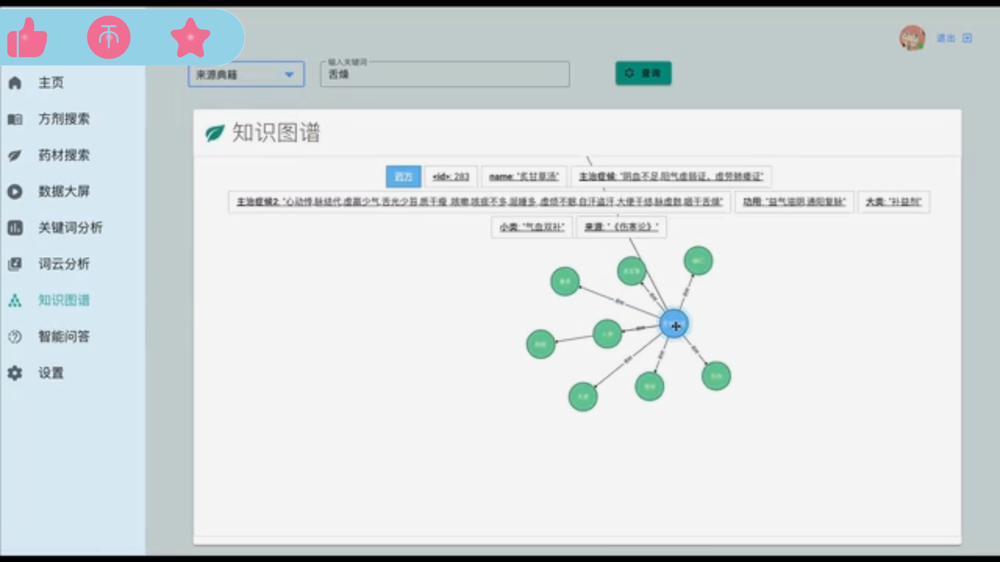
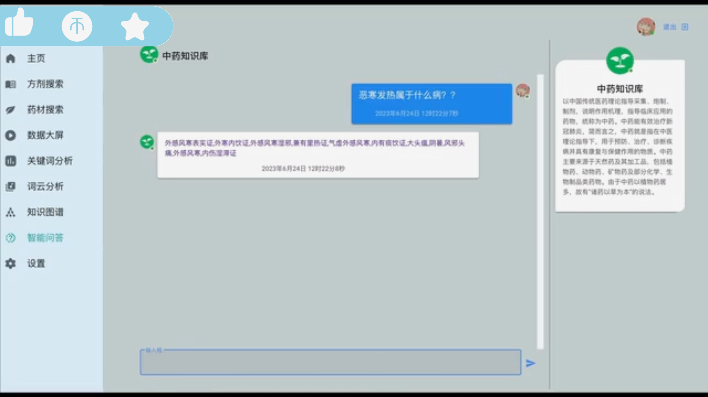
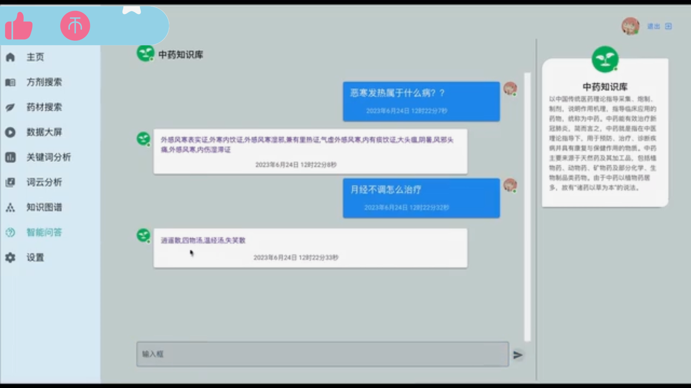
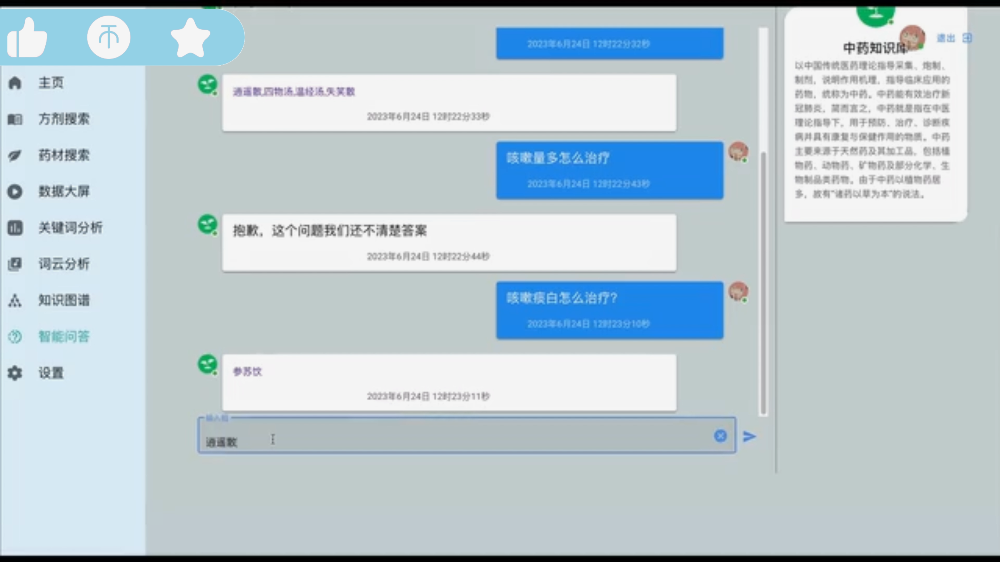
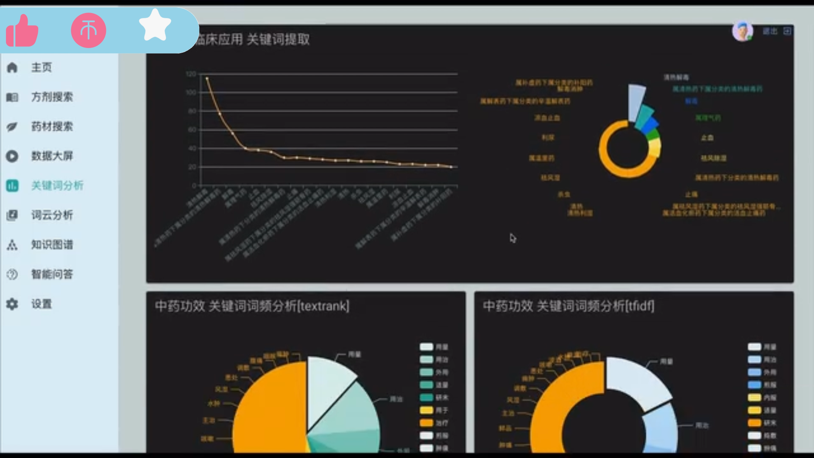
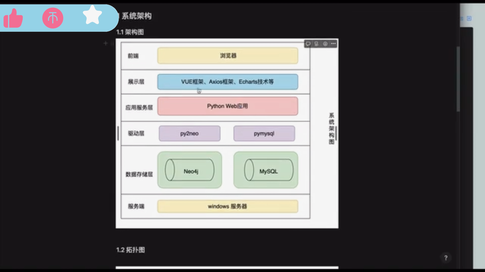
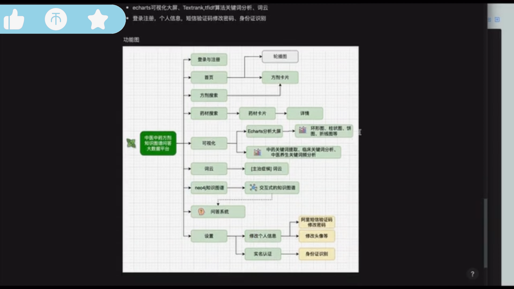

## 计算机毕业设计python+neo4j知识图谱中医问答系统 中医中药方剂大数据可视化 vue.js 前后端分离 大数据毕业设计 机器学习 深度学习 人工智能 

## 要求
### 源码有偿！一套(论文 PPT 源码+sql脚本+教程)

### 
### 加好友前帮忙start一下，并备注github有偿纯python中药问答2025
### 我的QQ号是2827724252或者798059319或者 1679232425或者微信:bysj2023nb 或bysj1688

# 

### 加qq好友说明（被部分 网友整得心力交瘁）：
    1.加好友务必按照格式备注
    2.避免浪费各自的时间！
    3.当“客服”不容易，repo 主是体面人，不爆粗，性格好，文明人。
	
## 功能介绍
基于知识图谱的中医中药问答系统(实现症状问病症、病症问药方、药方问药材-具体见演示视频） 
知识图谱带模糊查询
方剂查询
中药查询
echarts可视化大屏、Textrank,tfidf算法关键词分析、词云
登录注册，个人信息，短信验证码修改密码、身份证识别	

## 演示视频
https://www.bilibili.com/video/BV1E4421S7jN/?spm_id_from=333.999.0.0

## 运行截图

